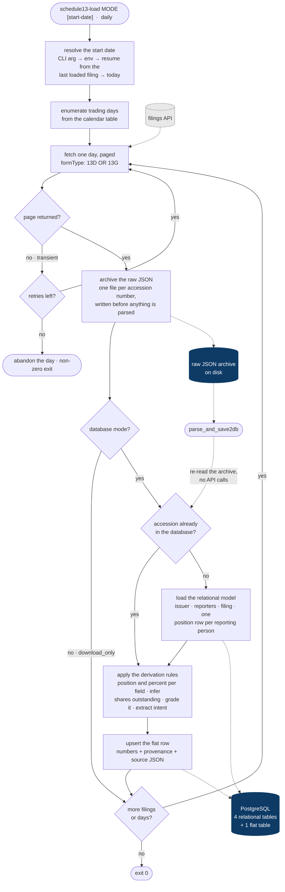

# SEC Schedule 13D / 13G Filing Pipeline

**A daily ETL that turns unstructured beneficial-ownership filings into a queryable ownership
database — with the provenance of every derived number attached to it.**

When an investor crosses **5% of a US public company's voting shares**, US securities law requires
them to say so. Those disclosures — Schedules 13D and 13G — are the public record of who owns a
meaningful stake in what, who is accumulating, and who has just walked away. They are also messy:
the same fact appears twice with different values, group members double-count each other, and the
one number an analyst actually wants — how many shares the company has outstanding — is never
stated. This pipeline collects them daily, loads them into PostgreSQL, and derives the missing
numbers under rules that are explicit, tested and individually attributable.

**56,004 filings** covering **2025-01-02 → 2026-08-14** in the reference deployment.

---

## The forms

| Form | What it is | Who files it | Deadline |
|---|---|---|---|
| **SC 13D** | The "activist" long-form. Filed by anyone acquiring beneficial ownership of more than 5% of a voting class who **intends to influence control** — board seats, a sale, a strategy change. Item 4 states the purpose of the transaction in prose. | Strategic buyers, activists, control persons | Within 5 business days of crossing 5% |
| **SC 13D/A** | Amendment to a 13D. Required "promptly" on any material change — typically a 1% move in the position, or a change of intent. The amendment stream is the position's history. | Same filer | Within 2 business days of the change |
| **SC 13G** | The short-form alternative for **passive** holders: qualified institutions holding in the ordinary course of business, and passive investors below 20% with no control intent. No intent narrative, because there is no intent to declare. | Asset managers, banks, insurers, passive holders | 45 days after the quarter in which 5% was crossed (institutions); 5 business days (passive holders) |
| **SC 13G/A** | Amendment to a 13G. Most commonly the periodic refresh of a passive position, or the exit filing that takes a holder below 5%. The single highest-volume form in the dataset. | Same filer | 45 days after quarter end for a material change, with accelerated monthly triggers above 10% |

*Deadlines reflect the SEC's amended Rule 13d-1/13d-2 timetable effective February 2024.*

The distinction matters more than the volume suggests: a **13D is a statement of intent**, while a
**13G is a statement of size**. A holder converting a 13G into a 13D on the same position is
announcing that a passive stake has become an active one — one of the highest-signal events in the
dataset, and visible here as two rows sharing a CUSIP with different `form_type` values.

Observed distribution: `SC 13G/A` 30,581 · `SC 13G` 16,486 · `SC 13D/A` 7,130 · `SC 13D` 1,807.

## What it does



1. **Enumerate** trading days from the calendar table — filings only appear on trading days.
2. **Fetch** that day's 13D/13G filings, paged, with bounded retries.
3. **Archive** each filing's JSON verbatim, keyed by accession number, *before* parsing anything.
4. **Load** the relational model: issuer, reporting persons, the filing, and one position row per
   reporting person.
5. **Derive and upsert** the flat row: headline position, percentage, inferred shares outstanding,
   the concatenated narrative, and a resolved ticker.

## The derivation rules

These are the reason the project is not a twenty-line script.

**Shares outstanding is inferred, then graded.** A Schedule 13 never states the issuer's share
count, but every reporting person implicitly reveals it: `shares / (percent / 100)`. Each qualifying
row yields one estimate and the median is taken — the *lower-middle* median, so the answer is always
a value some row actually produced, never an average of two disagreeing rows. Every result ships
with a `total_shares_source` grade: `owners_row`, `item4`, `inconsistent` or `unknown`.

**Conversion blockers are excluded.** Convertible notes and warrants carry contractual caps ("may
not convert beyond 9.99% of the class"). Filers report an `aggregateAmountOwned` that *includes* the
underlying shares while the percentage is computed on a denominator that *excludes* them under Rule
13d-3. Dividing one by the other fabricates a share count — one observed filing implies 14.8 billion
shares against a real count near 800,000. Rows sitting at 4.9 / 4.99 / 9.9 / 9.99% are dropped
whenever a clean row exists, and the filing is graded `inconsistent` when they are all there is.

**Estimates that disagree by more than 25% are flagged, not discarded.** The value is still stored;
whether to trust it is the consumer's decision, made against `total_shares_source`.

**Position and percentage are resolved field by field, not as a block.** The cover-page item 4 wins
when populated, because it is the filer's own headline number. But 13G cover pages routinely carry a
placeholder `amountBeneficiallyOwned` of `0` next to a real `classPercent`, so each field falls back
to the reporting-person rows independently. Both carry a `*_source` column.

**Group rows are maxed, never summed.** A group files one Schedule with a row per member plus a row
for the group as a whole. Summing would count each member against its own fund.

Every rule above is covered by a test in [`tests/test_normalize.py`](tests/test_normalize.py).

## Running it

```bash
pip install -e .                       # or: pip install -r requirements.txt
cp .env.example .env                   # then fill in the API key and PostgreSQL settings

schedule13-load download_parse_save2db            # resume from the last loaded date
schedule13-load download_parse_save2db 20260101   # from an explicit start date
schedule13-load download_only 20260101 --end-date 20260131
schedule13-load parse_and_save2db                 # replay the local archive, no API calls
```

The three modes exist because the archive is authoritative: when a derivation rule changes,
`parse_and_save2db` replays years of filings into the database without re-paying for a single API
call. The schema is created on startup if missing, and the whole pipeline is idempotent — filings
are immutable once published, so a re-run inserts nothing new and refreshes the derived row in place.

## Third-party libraries

Everything else is the Python standard library.

| Library | Licence | Why |
|---|---|---|
| [`requests`](https://pypi.org/project/requests/) | Apache-2.0 | HTTP client for the filings API, with an explicit timeout and bounded retries. |
| [`psycopg[binary]`](https://pypi.org/project/psycopg/) | LGPL-3.0 | PostgreSQL driver (psycopg 3). Its `Json` adapter is what stores the untouched filing in a `JSONB` column. |
| [`python-dotenv`](https://pypi.org/project/python-dotenv/) | BSD-3-Clause | Loads `.env` in development. Optional at runtime. |
| [`pytest`](https://pypi.org/project/pytest/) *(dev)* | MIT | Test runner. |
| [`ruff`](https://pypi.org/project/ruff/) *(dev)* | MIT | Lint. |

Note there is **no vendor SDK**. The provider publishes a Python client, but the pipeline speaks to
the REST endpoint directly with `requests` — one POST, a documented request body, and a response
contract written down below. That keeps the dependency surface at three libraries and makes the
provider replaceable.

## Layout

```
src/schedule13/
  cli.py         the three modes, the day loop, resume logic
  fetch.py       paged API client, bounded retries, raw JSON archiving
  normalize.py   the derivation rules — pure functions, fully tested  ← the core
  db.py          schema management, relational load, normalised upsert
  config.py      every credential and tunable, from the environment
sql/schema.sql            the full DDL, documented column by column
docs/DATA_DICTIONARY.md   every column, every enumerated value, with example queries
tests/                    22 tests over the derivation rules
```

## Prerequisites

### 1. A filings-API subscription — the hard prerequisite

The filings themselves are public records, but this pipeline reads them through a **commercial API**
that serves EDGAR submissions pre-parsed into structured JSON. Without a key, nothing but
`parse_and_save2db` (which replays the local archive) will run.

| What you need | Detail |
|---|---|
| **Provider** | [sec-api.io](https://sec-api.io) — a paid service that parses EDGAR filings into JSON. |
| **API key** | Issued from the provider's dashboard. Set it as `SECAPI_KEY`. |
| **Plan** | Must include the **Form 13D/13G** endpoint. Plans differ in included request volume and rate limit; a full history load is far heavier than the daily increment. |
| **Alternative** | The same pipeline shape works against EDGAR's own free endpoints, which are XML/HTML rather than JSON — that swaps a subscription for a parser in front of `normalize.py`. Nothing downstream of `fetch.py` would change. |

### 2. The REST endpoint this pipeline calls

One endpoint, one POST per page. This is the whole vendor contract the code depends on.

```http
POST https://api.sec-api.io/form-13d-13g
Authorization: <SECAPI_KEY>          ← the raw key, no "Bearer " prefix
Content-Type: application/json

{
  "query": "formType:(13D OR 13G) AND filedAt:[2026-01-02 TO 2026-01-02]",
  "from":  "0",
  "size":  "50",
  "sort":  [ { "filedAt": { "order": "desc" } } ]
}
```

| Element | Detail |
|---|---|
| **Auth** | The API key goes in the `Authorization` header verbatim. Configure the URL with `SECAPI_13DG_URL` if the provider moves it. |
| **`query`** | Lucene/Elasticsearch-style syntax over the filing metadata. `formType:(13D OR 13G)` matches on the prefix, so all four forms — `SC 13D`, `SC 13D/A`, `SC 13G`, `SC 13G/A` — are covered by one query. The `filedAt` range is **inclusive at both ends**, which is why a single day is expressed as `[D TO D]`. |
| **`from` / `size`** | Offset paging. The provider caps `size` at **50** (`SCHEDULE13_PAGE_SIZE`), and deep offsets are capped too — querying one day at a time keeps every request in the shallow range, which is a correctness property, not just tidiness. |
| **`sort`** | Descending `filedAt`, so paging is stable within a day. |
| **Rate limit** | Plan-dependent. The pipeline self-paces: `SCHEDULE13_QUERY_PAUSE_SEC` (default 2 s) between pages, `SCHEDULE13_FILING_PAUSE_SEC` between database batches. Raise or lower to match your plan. |
| **Failures** | Network errors, non-2xx responses and unparseable bodies are retried `SCHEDULE13_MAX_RETRIES` times (default 5) with a fixed backoff, then the day is abandoned with a non-zero exit rather than looping forever. |

**Response contract.** The body is `{"total": {"value": N}, "filings": [ ... ]}`; a page shorter than
`size` ends the day. Each filing is consumed through these fields — a change to any of them is a
change to this pipeline:

| Field | Used for |
|---|---|
| `accessionNo` | The primary key of everything. Idempotency, the archive filename, the upsert target. |
| `formType` | `SC 13D` · `SC 13D/A` · `SC 13G` · `SC 13G/A`. |
| `filedAt` | Filing timestamp; also the resume point for the next run. |
| `nameOfIssuer`, `cusip` | Issuer identity; the CUSIP is normalised and resolved to a ticker. |
| `filers[]` | `{cik, name}` — the issuer block and the signing party. |
| `owners[]` | `{cik, name, aggregateAmountOwned, amountAsPercent, typeOfReportingPerson}` — one entry per reporting person. This array is what the shares-outstanding inference is built on. |
| `item1`, `item3`–`item6` | The narrative items: `commentText`, `fundsSource`, `transactionPurpose`, `transactionDescription`, `contractDescription`. |
| `item4` | `amountBeneficiallyOwned`, `classPercent` — the cover-page headline numbers. |
| `linkToFilingDetails` | The EDGAR URL, stored for provenance. |

### 3. Everything else

* **Python 3.10+**
* **PostgreSQL 12+** (`ON CONFLICT` upserts, `JSONB`)
* A **`bizcal`** trading-calendar table, and optionally a **`sec_info`** security master for
  CUSIP → ticker resolution. Both table names are configurable; without `sec_info`, `ticker` simply
  stays `NULL`.
* **Disk** for the raw archive: one JSON file per filing, ~56,000 files for the reference period.

## Licence

[MIT](LICENSE) — use it, modify it, ship it; keep the copyright notice with any copy.

Third-party dependencies are distributed under their own licences, listed under
[Third-party libraries](#third-party-libraries) above.

The licence covers **this source code only**. SEC filings are public records, but the filings API
used to retrieve them is a commercial service governed by its own terms; no filing data is included
in this repository, and nothing here grants any right over data you fetch with it.
