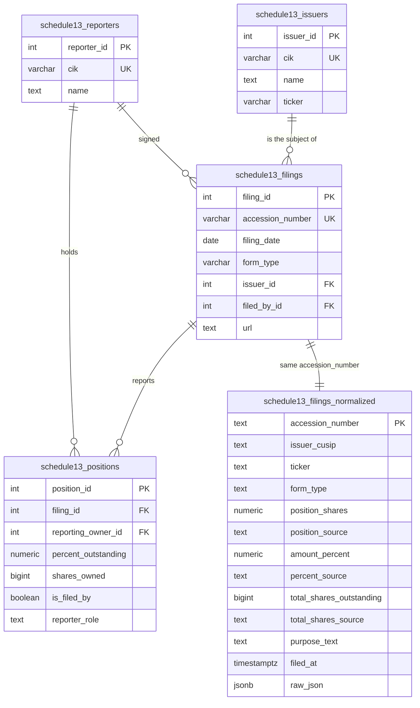

# Data Dictionary — Schedule 13D/13G Database

Five tables in PostgreSQL, created by [`sql/schema.sql`](../sql/schema.sql). Everything is keyed on
the SEC **accession number**, the immutable identifier of a submitted filing.



Two shapes over the same filings, on purpose. The relational model answers *who holds what* — one
row per reporting person, joinable across filings and issuers. The flat table answers *what does
this filing say* — one row, headline numbers already resolved, fast to screen, with the original
document attached so any rule can be replayed later.

---

## `schedule13_issuers`

The company whose shares are being reported on. One row per issuer.

| Column | Type | Null | Description |
|---|---|---|---|
| `issuer_id` | `SERIAL` | no | Surrogate primary key. |
| `cik` | `VARCHAR` | no | SEC Central Index Key of the issuer. Unique — the natural key. |
| `name` | `TEXT` | no | Issuer name as printed on the filing. Not normalised: filers spell the same company several ways, and the filed spelling is evidence. |
| `ticker` | `VARCHAR` | yes | Trading symbol, when the filing carries one. Often absent; the normalised table resolves it from the CUSIP instead. |

## `schedule13_reporters`

An institution, fund or individual that reports a position. The same entity appears across thousands
of filings, which is why it has its own table rather than a repeated name string.

| Column | Type | Null | Description |
|---|---|---|---|
| `reporter_id` | `SERIAL` | no | Surrogate primary key. |
| `cik` | `VARCHAR` | yes | SEC CIK. Unique where present; `NULL` for parties filing without one (PostgreSQL treats NULLs as distinct, so those rows are never collapsed together). |
| `name` | `TEXT` | no | Reporting person's name as filed. Indexed — name is the practical search key when a CIK is unknown. |

## `schedule13_filings`

One submitted Schedule 13D/13G or amendment.

| Column | Type | Null | Description |
|---|---|---|---|
| `filing_id` | `SERIAL` | no | Surrogate primary key. |
| `accession_number` | `VARCHAR` | no | SEC accession number, e.g. `0001104659-26-012345`. Unique. The idempotency key for the whole pipeline. |
| `filing_date` | `DATE` | no | Date the filing was accepted by EDGAR. |
| `form_type` | `VARCHAR` | no | `SC 13D` · `SC 13D/A` · `SC 13G` · `SC 13G/A`. |
| `issuer_id` | `INTEGER` | yes | → `schedule13_issuers`. |
| `filed_by_id` | `INTEGER` | yes | → `schedule13_reporters`: the party that signed the filing. Taken from the second filer block when the document carries both issuer and filer, otherwise the first. |
| `url` | `TEXT` | yes | Link to the filing on EDGAR. |

Indexed on `(issuer_id, filing_date DESC)` — the ownership-history-for-a-company query — and on
`(form_type, filing_date DESC)` for form-type screens.

## `schedule13_positions`

What one reporting person reported in one filing. **One row per person per filing**, enforced by a
unique index so re-running a load cannot duplicate them.

| Column | Type | Null | Description |
|---|---|---|---|
| `position_id` | `SERIAL` | no | Surrogate primary key. |
| `filing_id` | `INTEGER` | no | → `schedule13_filings`. |
| `reporting_owner_id` | `INTEGER` | no | → `schedule13_reporters`. |
| `percent_outstanding` | `NUMERIC` | yes | Percent of the voting class, as reported. `8.58` means 8.58%. |
| `shares_owned` | `BIGINT` | yes | Aggregate beneficial ownership in shares, as reported. May include shares underlying convertibles. |
| `position_dollar` | `NUMERIC` | yes | Notional value. Reserved for a downstream pricing job; not populated by this pipeline. |
| `is_filed_by` | `BOOLEAN` | yes | True when this reporting person is the party that signed the filing. |
| `ownership_type` | `VARCHAR` | yes | Sole or shared, when stated. |
| `reporter_role` | `TEXT` | yes | Item 2 type of reporting person: `IA` investment adviser, `CO` corporation, `IN` individual, `PN` partnership, `FI` bank, `HC` holding company, and others. |
| `notes` | `TEXT` | yes | Free-text annotation slot. |
| `sole_voting_power` | `BIGINT` | yes | Item 5 voting/dispositive breakdown. Reserved: the structured feed does not currently populate these four columns, and they are kept so an EDGAR-XML source can fill them without a migration. |
| `shared_voting_power` | `BIGINT` | yes | — |
| `sole_dispositive_power` | `BIGINT` | yes | — |
| `shared_dispositive_power` | `BIGINT` | yes | — |

> **Do not sum these rows.** A group files a single Schedule with a row per member *plus* a row for
> the group as a whole. Summing counts each member twice. Take the maximum, or filter to the group
> row — which is what the normalised table does for you.

## `schedule13_filings_normalized`

One row per filing: the headline numbers resolved, each next to the field it came from, plus the
untouched source document.

| Column | Type | Null | Description |
|---|---|---|---|
| `accession_number` | `TEXT` | no | Primary key. Joins to `schedule13_filings.accession_number`. |
| `issuer_cusip` | `TEXT` | no | CUSIP reduced to uppercase alphanumerics (`30049 A 10 9` → `30049A109`). Indexed. |
| `issuer_name` | `TEXT` | no | Issuer name as filed. Indexed on `lower(issuer_name)`. |
| `ticker` | `TEXT` | yes | Resolved from the CUSIP against the security master. Best-effort: a previously resolved ticker is never overwritten with `NULL` on a later load. |
| `form_type` | `TEXT` | yes | `SC 13D` · `SC 13D/A` · `SC 13G` · `SC 13G/A`. |
| `reporters` | `TEXT` | no | Comma-separated reporting persons, filing order, deduped case-insensitively. |
| `filers` | `TEXT` | no | Comma-separated filer entities, same treatment. |
| `position_shares` | `NUMERIC` | yes | Headline position in shares. |
| `position_source` | `TEXT` | yes | Where it came from: `item4.amountBeneficiallyOwned` · `owners.aggregateAmountOwned` · `unknown`. |
| `amount_percent` | `NUMERIC` | yes | Headline position as a percent of the class. `8.58` = 8.58%. |
| `percent_source` | `TEXT` | yes | `item4.classPercent` · `owners.amountAsPercent` · `unknown`. Resolved independently of `position_source`, because 13G cover pages pair a placeholder `0` share count with a real percentage. |
| `total_shares_outstanding` | `BIGINT` | yes | Shares outstanding **inferred** from `shares / (percent/100)`, as the median across qualifying rows. Never stated in the filing itself. |
| `total_shares_source` | `TEXT` | yes | The grade on that inference — see below. Always check it before using the number. |
| `total_shares_owner` | `TEXT` | yes | The reporting person whose row produced the median estimate. |
| `purpose_text` | `TEXT` | yes | The narrative items concatenated, each tagged with its source: `[Comment]` item 1, `[Source of Funds]` item 3, `[Purpose]` item 4, `[Transactions]` item 5, `[Contracts]` item 6. Mostly populated on 13Ds — a 13G has no intent to declare. |
| `filed_at` | `TIMESTAMPTZ` | yes | Filing acceptance timestamp, with the offset as filed. Indexed descending. |
| `raw_json` | `JSONB` | yes | The filing exactly as received. Makes every rule replayable without re-fetching, and keeps fields this schema does not model queryable via `->`. |

### `total_shares_source` — the grades

| Value | Meaning | Safe to use? |
|---|---|---|
| `owners_row` | Derived from the reporting-person rows; the surviving estimates agree within 25%. | Yes. |
| `item4` | No usable owner rows; derived from the cover-page item 4 totals. | Yes, with less corroboration. |
| `inconsistent` | A value was derived but should not be trusted: the estimates disagree by more than 25%, or every contributing row sat at a conversion-blocker percentage (4.9 / 4.99 / 9.9 / 9.99). | **No** — filter these out. |
| `unknown` | Nothing usable in the filing; `total_shares_outstanding` is `NULL`. | n/a |

### Example queries

```sql
-- Every activist stake declared this month, largest first
SELECT filed_at::date, ticker, issuer_name, reporters, amount_percent, position_shares
FROM schedule13_filings_normalized
WHERE form_type = 'SC 13D'
  AND filed_at >= date_trunc('month', now())
ORDER BY amount_percent DESC NULLS LAST;

-- A passive stake turning active: same holder, same issuer, 13G then 13D
SELECT g.ticker, g.reporters, g.filed_at AS passive_at, d.filed_at AS active_at
FROM schedule13_filings_normalized g
JOIN schedule13_filings_normalized d
  ON d.issuer_cusip = g.issuer_cusip
 AND d.reporters    = g.reporters
 AND d.filed_at     > g.filed_at
WHERE g.form_type LIKE 'SC 13G%'
  AND d.form_type LIKE 'SC 13D%';

-- Implied float, trustworthy rows only
SELECT ticker, issuer_name, total_shares_outstanding, total_shares_owner, filed_at::date
FROM schedule13_filings_normalized
WHERE total_shares_source IN ('owners_row', 'item4')
  AND total_shares_outstanding IS NOT NULL
ORDER BY filed_at DESC;

-- One institution's book, through the relational model
SELECT f.filing_date, f.form_type, i.name AS issuer, p.shares_owned, p.percent_outstanding
FROM schedule13_positions  p
JOIN schedule13_filings    f ON f.filing_id = p.filing_id
JOIN schedule13_issuers    i ON i.issuer_id = f.issuer_id
JOIN schedule13_reporters  r ON r.reporter_id = p.reporting_owner_id
WHERE r.name ILIKE 'BlackRock%'
ORDER BY f.filing_date DESC;

-- Intent, in the filer's own words
SELECT ticker, issuer_name, filed_at::date, purpose_text
FROM schedule13_filings_normalized
WHERE form_type = 'SC 13D'
  AND purpose_text ILIKE '%board%'
ORDER BY filed_at DESC;
```

---

## Reference inputs

| Table | Columns used | Purpose |
|---|---|---|
| `bizcal` | `bizdate` | Trading-day calendar; drives the day loop so no request is spent on a weekend or holiday. Configurable via `SCHEDULE13_BIZCAL_TABLE`. |
| `sec_info` | `cusip`, `ticker` | CUSIP → ticker resolution. Rows hold several space-separated CUSIPs per security, hence a containment match on the 9-character CUSIP. Configurable via `SCHEDULE13_TICKER_TABLE`. |

## Raw archive

```
<DOWNLOAD_PATH>/0001104659-26-012345.json      one file per filing, exactly as received
```

Written before anything is parsed. It is what makes `parse_and_save2db` possible: a derivation rule
can change and years of filings can be reloaded without a single API call.
